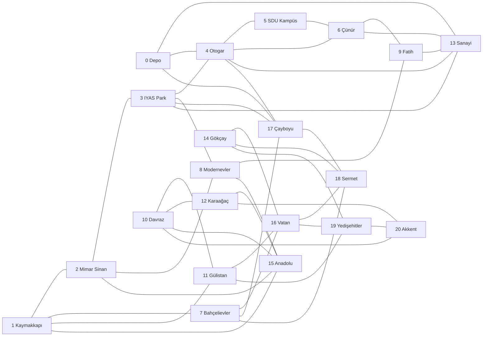

# Gül Kremi Teslimat Rota Planlama Projesi

## 1. Problem Tanımı

Isparta'da gül kremi satan bir şirketin 20 farklı satış noktası vardır. Her gün bu noktalardan farklı bir kısmı sipariş verebilir. Şirketin varsayılan olarak 4 aracı bulunur ve uygulama, sipariş gelen noktaların depodan başlayıp tekrar depoya dönecek şekilde araçlara dağıtılmasını sağlar.

Amaç, graf üzerindeki yol mesafelerini kullanarak toplam teslimat mesafesini azaltan kısa rotalar üretmektir. Araç sayısı program çalışırken değiştirilebilir; bu nedenle metindeki "iki araç" ifadesi için de aynı uygulama 2 araçla çalıştırılabilir.

## 2. Varsayımlar

- `0` numaralı nokta depodur.
- `1-20` arası noktalar satış/teslimat noktalarıdır.
- Bütün araçlar depodan çıkar ve teslimat sonunda depoya döner.
- Günlük sipariş listesi kullanıcıdan alınır.
- Yol ağı ağırlıklı ve yönsüz graf olarak modellenmiştir.
- Kenar ağırlıkları kilometre cinsinden yaklaşık yol mesafesidir.
- Araç kapasitesi verilmediği için durak sayısı araçlar arasında dengeli dağıtılmıştır.

## 3. Kullanılan Veri Yapıları

Uygulamada graf kullanımı zorunlu olduğu için teslimat ağı şu şekilde modellenmiştir:

- `DeliveryPoint`: nokta id'si, adı ve koordinat bilgisini tutar.
- `Edge`: iki nokta arasındaki yol bağlantısını ve mesafeyi tutar.
- `Graph`: adjacency-list yapısı ile tüm noktaları ve yolları tutar.
- `DijkstraResult`: bir başlangıç noktasından diğer noktalara olan en kısa mesafe ve önceki düğüm bilgisini tutar.
- `Route`: bir aracın teslimat durak sırasını tutar.
- `RoutePlanner`: araç rotalarını oluşturan algoritmayı çalıştırır.

Graf temsili:

```text
Map<Integer, List<Edge>> adjacencyList
```

Bu yapı sayesinde her noktanın komşu yollarına hızlıca erişilir.

## 4. Algoritma

Uygulama rota planlamayı şu adımlarla yapar:

1. Isparta teslimat noktaları ve yol bağlantıları ile graf oluşturulur.
2. Sipariş gelen noktalar kullanıcıdan alınır.
3. Depo ve sipariş noktalarından diğer noktalara en kısa yollar Dijkstra algoritmasıyla hesaplanır.
4. Sipariş noktaları depoya uzaklığa göre büyükten küçüğe sıralanır.
5. En uzak noktalar araçlara başlangıç durağı olarak atanır.
6. Kalan noktalar, mevcut rotaya eklendiğinde mesafeyi en az artıran konuma yerleştirilir.
7. Her araç rotası 2-opt iyileştirmesiyle yeniden düzenlenir.
8. Her araç için durak sırası, parça parça en kısa yol ve toplam mesafe yazdırılır.

Bu yaklaşım sezgisel bir araç rotalama çözümüdür. Dijkstra graf üzerindeki gerçek en kısa yolları bulur; araçlara dağıtım kısmı ise pratik ve anlaşılır bir rota iyileştirme yöntemi kullanır.

## 5. Karmaşıklık

- Dijkstra: `O((V + E) log V)`
- Sipariş sıralama: `O(N log N)`
- En ucuz ekleme: yaklaşık `O(N * A * R)`
- 2-opt iyileştirme: her rota için yaklaşık `O(R^3)`

Burada `V` graf düğüm sayısı, `E` kenar sayısı, `N` günlük sipariş noktası sayısı, `A` araç sayısı ve `R` bir araçtaki durak sayısıdır.

## 6. Graf Yapısı

Aşağıdaki çizim proje içinde kullanılan 1 depo ve 20 teslimat noktasından oluşan grafı gösterir.



Mermaid çizimi ayrıca `docs/graf_yapisi.mmd`, Graphviz çizimi `docs/graf_yapisi.dot`, doğrudan açılabilir SVG çizimi ise `docs/graf_yapisi.svg` dosyasında bulunur.

## 7. Çalıştırma

Terminalden:

```bash
cd GulKremiRotaPlanlama
javac -encoding UTF-8 -d out src/*.java
java -cp out Main
```

Örnek giriş:

```text
1,3,5,8,12,16,20
4
```

Program her araç için rota sırasını, graf üzerindeki en kısa yol parçalarını ve toplam teslimat mesafesini ekrana yazar.
